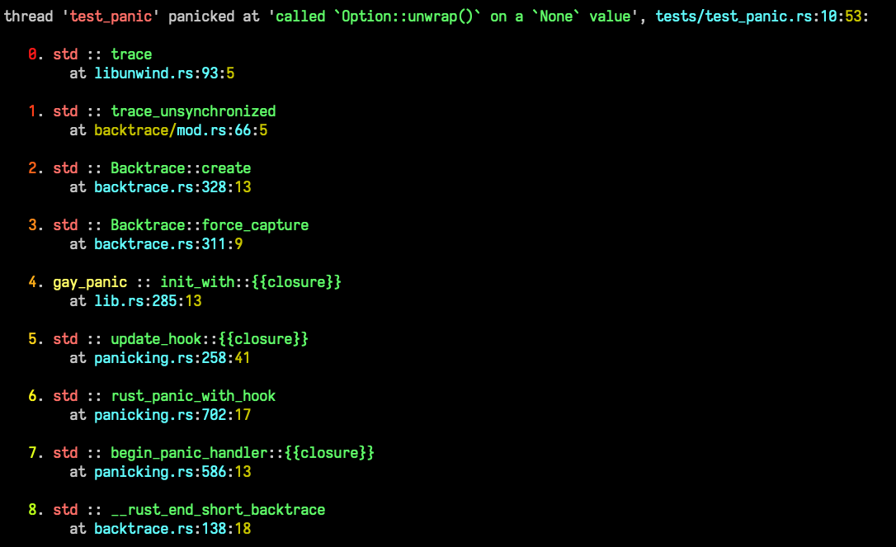

# gay_panic

A Rust panic handler, but make it gay.

[](https://github.com/mistodon/gay_panic/actions/workflows/rust.yml)
[](https://docs.rs/gay_panic/1.0.0/gay_panic/)
[](https://crates.io/crates/gay_panic)
<!-- [](https://codecov.io/github/mistodon/gay_panic) -->


A panic handler that shows pretty backtraces:

```rust
fn main() {
    use gay_panic::Config;

    gay_panic::init_with(Config {
        call_previous_hook: false,
        force_capture_backtrace: true,
    });
}
```


